# ローカル（自分のPC）のフォルダをGitHubにプッシュするやり方（Windows編）

## 手順
1. リモートリポジトリを作成する
2. 自分のPCのフォルダをローカルリポジトリに追加する
3. 手順1で作成したリモートリポジトリと手順2で作成したローカルリポジトリを接続する
4. addする
5. commitする
6. pushする

### 1. リモートリポジトリを作成する
1. 以下のURLにアクセスする。ログインがまだの場合ログインもする。  
リモートリポジトリを作成する  
https://github.com/

2. 右上の「＋」アイコンをクリックし、「New repository」をクリックする
  

3. リポジトリ名を入力し、 「Create repository」をクリックする
  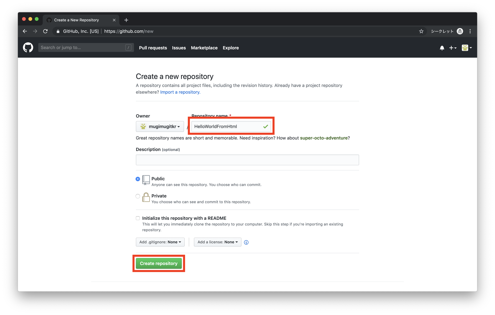

4. 以下のような画面が表示されればOKです
  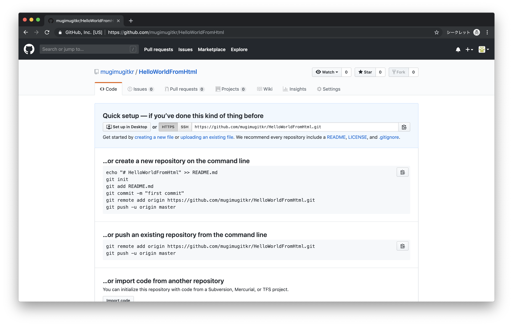

### 2. 自分のPCのフォルダをローカルリポジトリに追加する
1. SourceTreeを開き、タブの「＋」をクリックする
  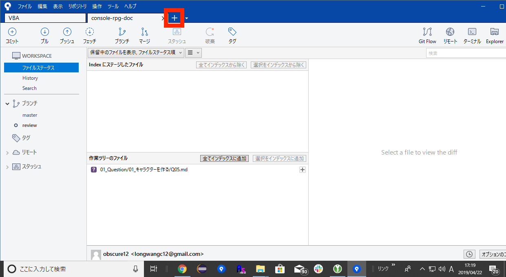

2. 「Create」アイコンをクリックする
  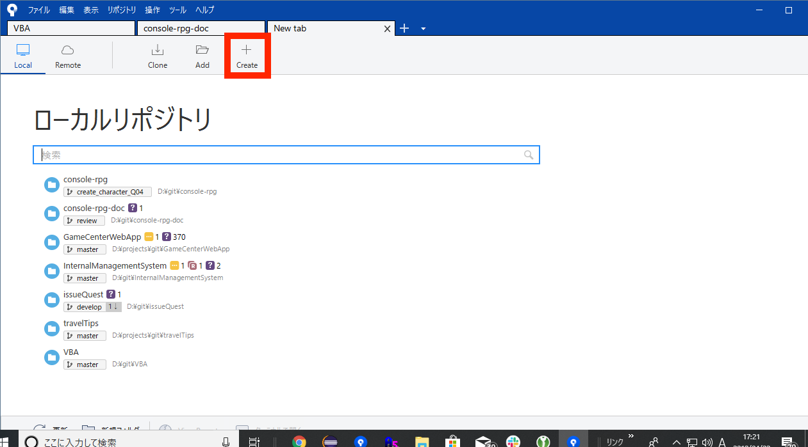

3. 「参照」をクリックする
  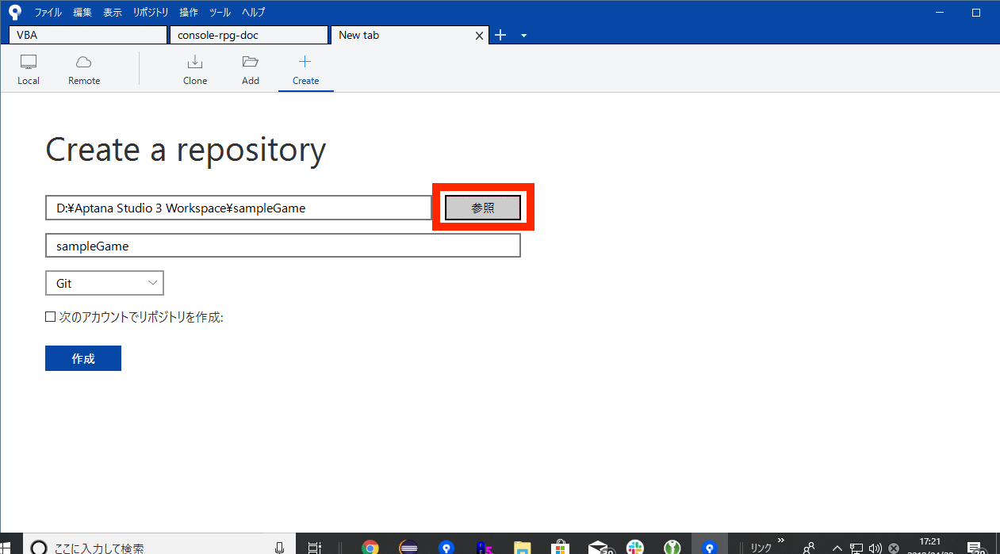

4. GitHubに上げたいフォルダを選択し、「フォルダーの選択」をクリックする
  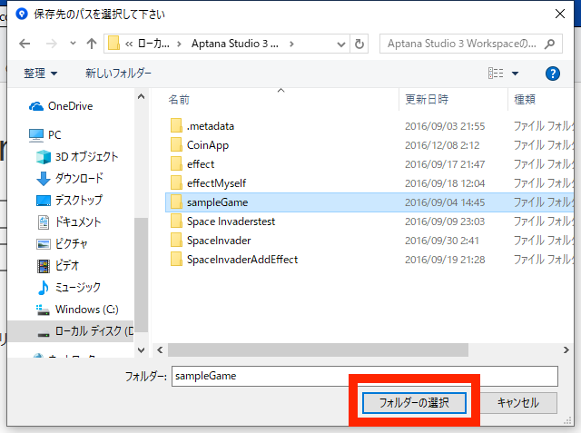

5. 「作成」をクリックする
  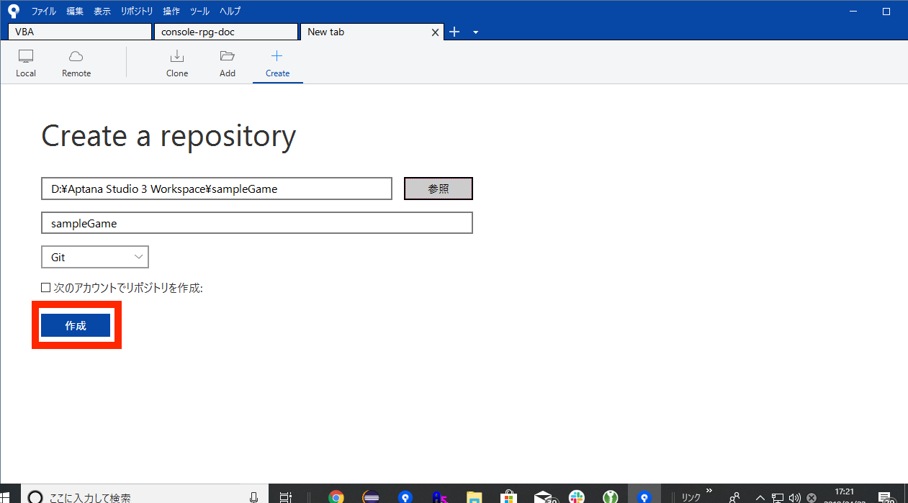

6. 以下のような画面が表示されたら、「はい」をクリックする
  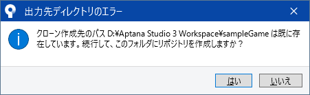

7. 以下のような画面が表示されればOK
  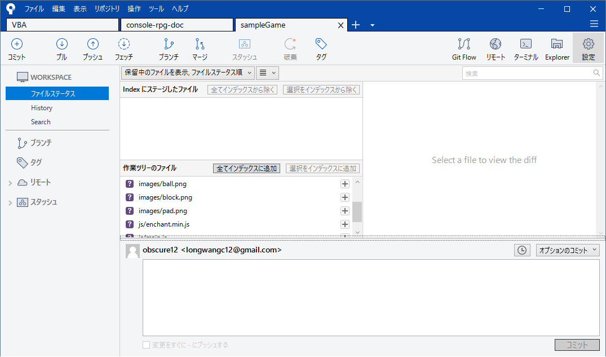

### 3. 手順1で作成したリモートリポジトリと手順2で作成したローカルリポジトリを接続する
1. 設定アイコンをクリックする
  

2. 「追加」をクリックする
  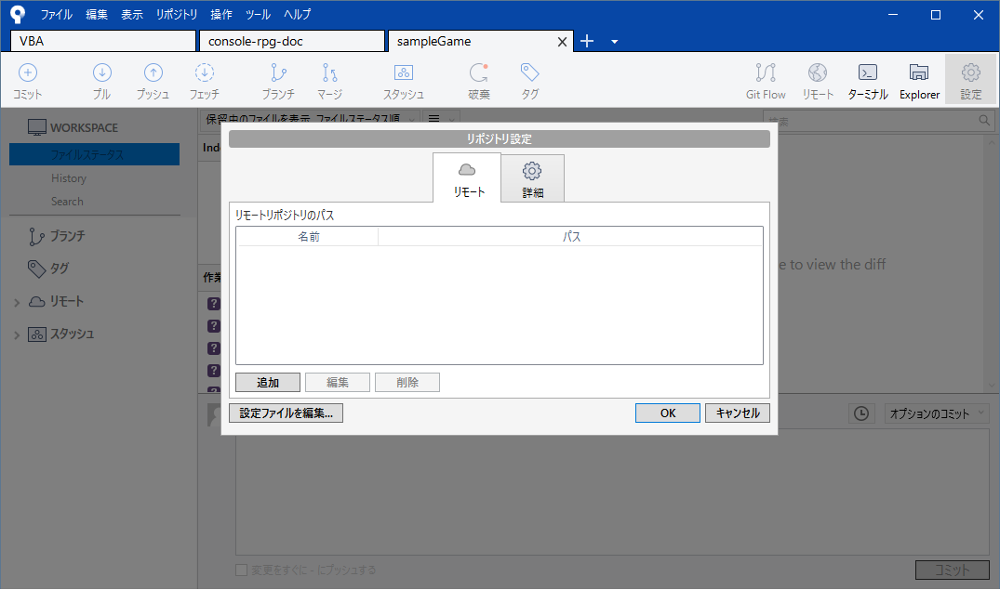

3. リモート名に「origin」と入力する。  
URL / パスには手順1で作成したリモートリポジトリのURLGitHub取得し、貼り付ける。  
入力できたら「OK」をクリックする。
  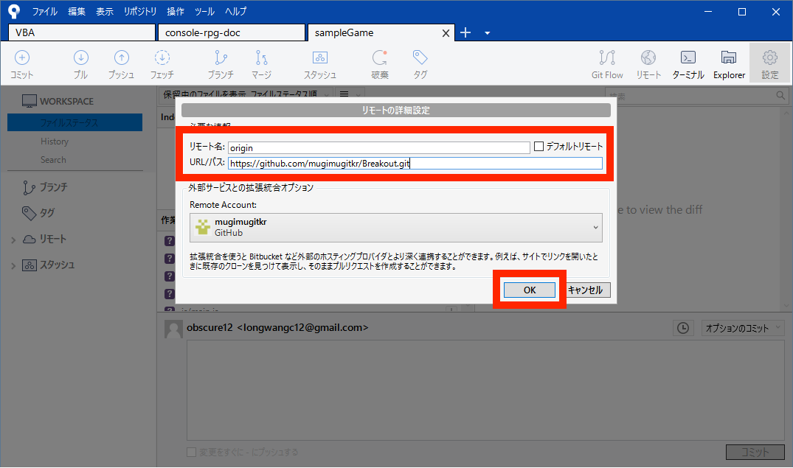
  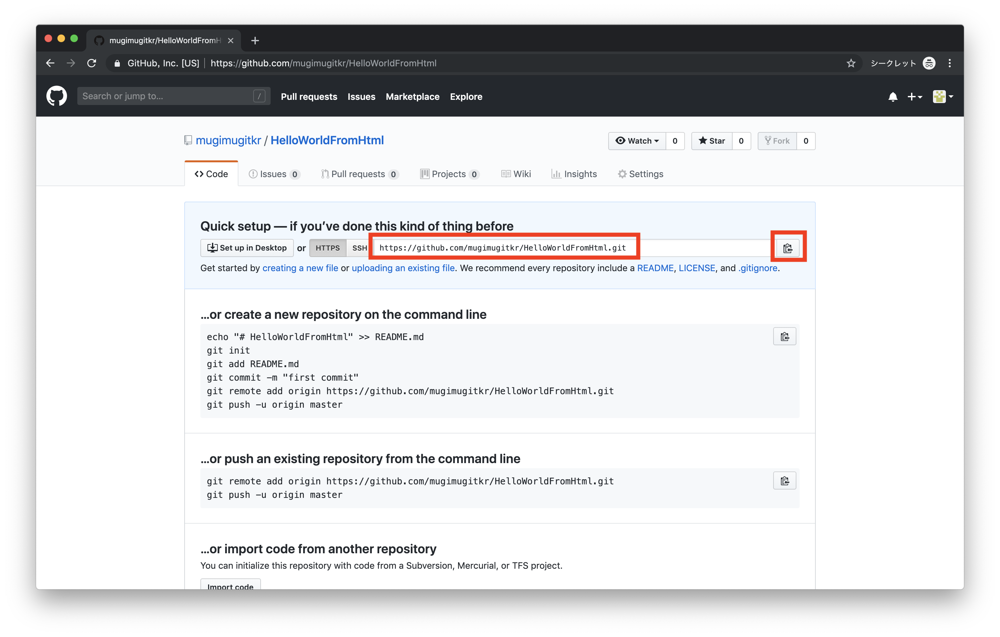

4. リモートリポジトリが追加されていることを確認し、「OK」をクリックする
  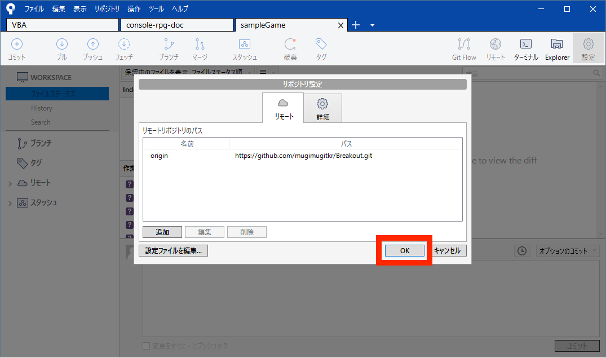

### 4. addする
1. 「全てインデックスに追加」クリックし、**add**する。
  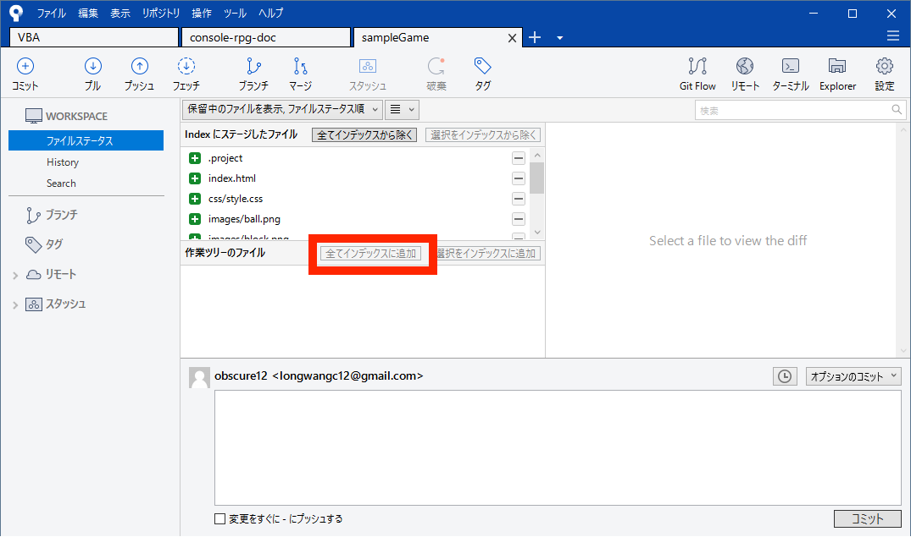

### 5. commitする
1. コミットメッセージを入力し、**commit**する。
  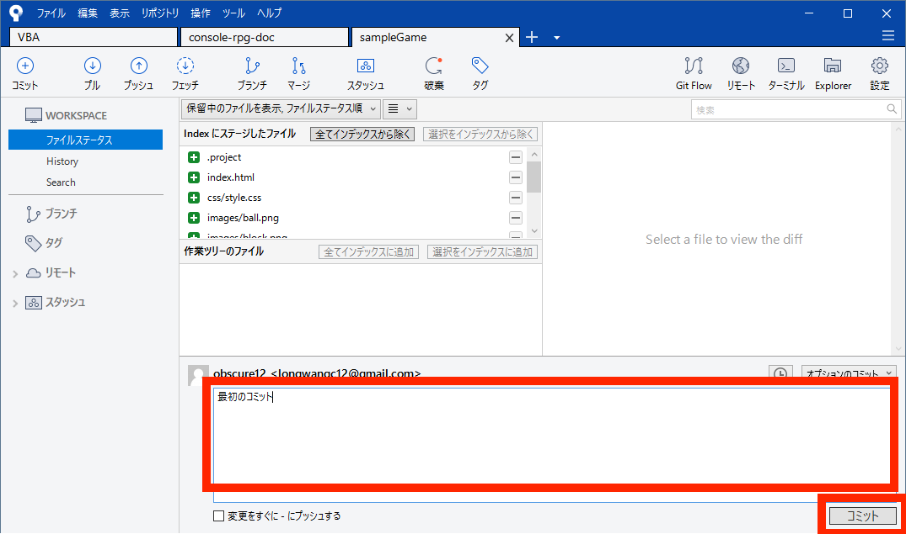

### 6. pushする
1. プッシュアイコンをクリックする
  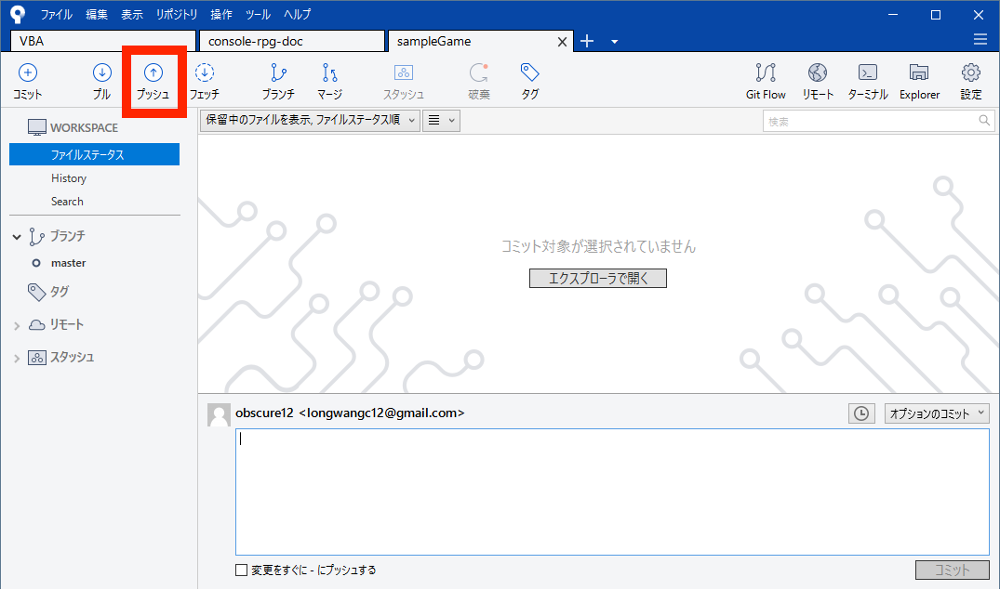

2. masterをクリックし、「OK」をクリックする
  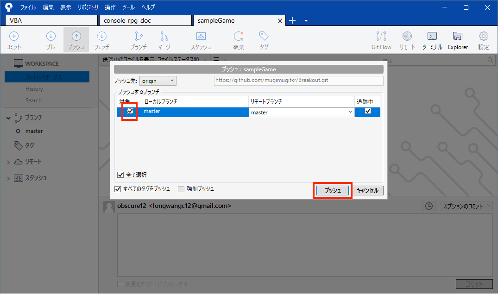

3. pushが完了したら、GitHubのページに行き、pushしたファイルが追加されていることを確認する
  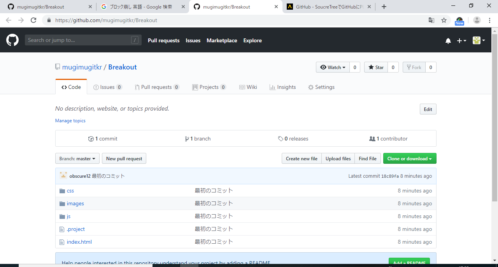