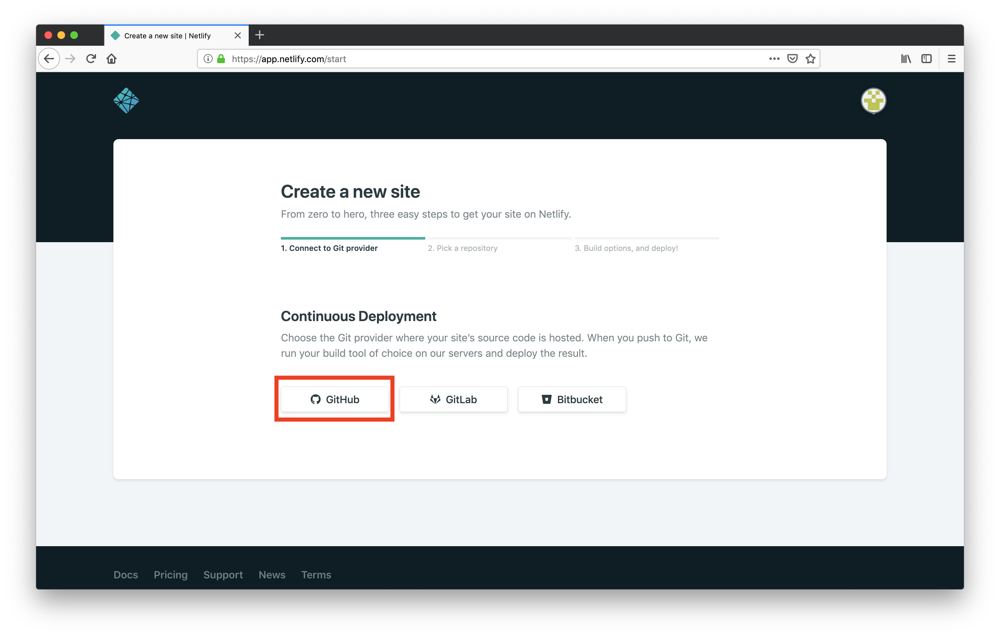
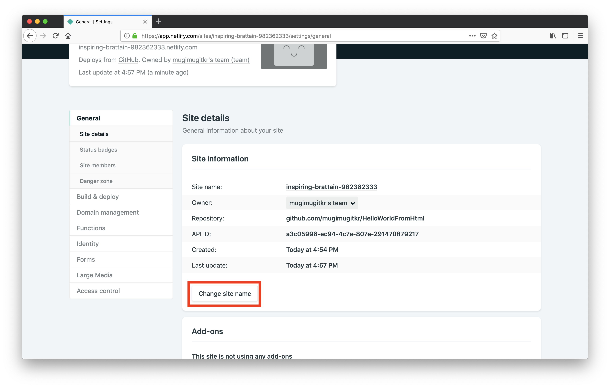

# GitHubにあるWebサイトをnetlifyで公開する方法

1. 以下のURLにアクセスし、「Log in」をクリックする  
https://www.netlify.com/
  

2. 「GitHub」を選択する
  

3. 「New site from Git」を選択する
  
  
4. 「GitHub」を選択する
  
  
5. 以下のような画面が表示されたら、「Authorize Netlify by Netlify」を選択する
  
  
6. 以下のような画面が表示されたら、「Install」を選択する
  
  
7. 以下のような画面が表示されたら、自分が公開したいWebサイトのリポジトリ名をクリックする
  

8. 以下のような画面が表示されたら、「Deploy site」をクリックする
  

9. 完了したら、画面に表示されているURLをクリックし、きちんと公開されていることを確認する
  
  

# [おまけ] URLを変えたい場合
1. 「Site settings」をクリックする
  

2. 「Change site name」をクリックする
  

3. 好きなサイト名（ドメイン）を入力し、「Save」をクリックする
  

4. URLが変わっていることを確認してください
  